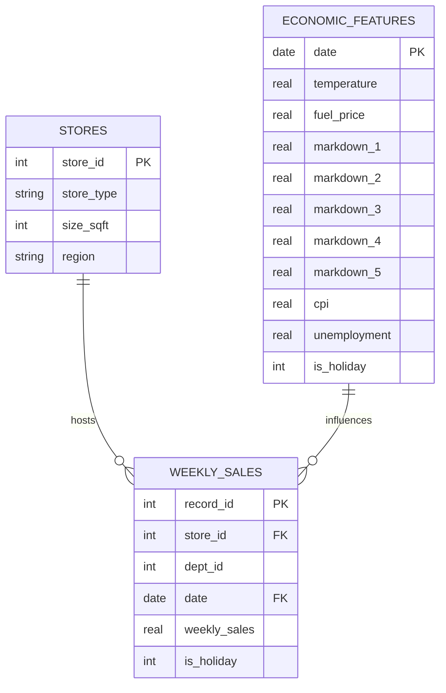
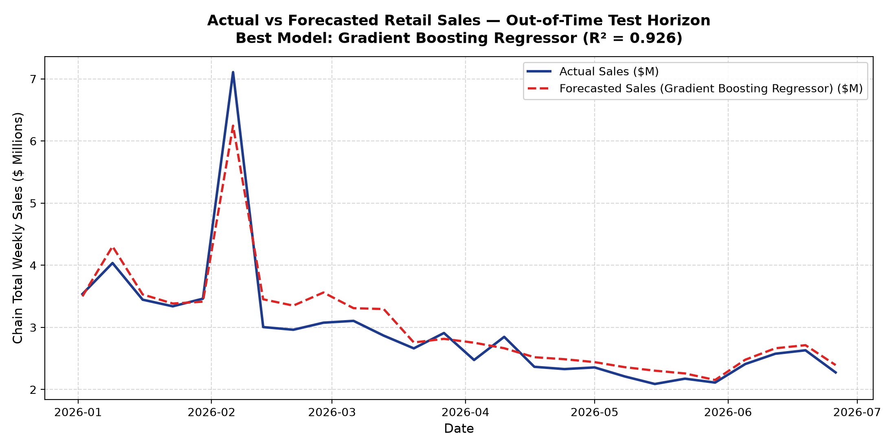
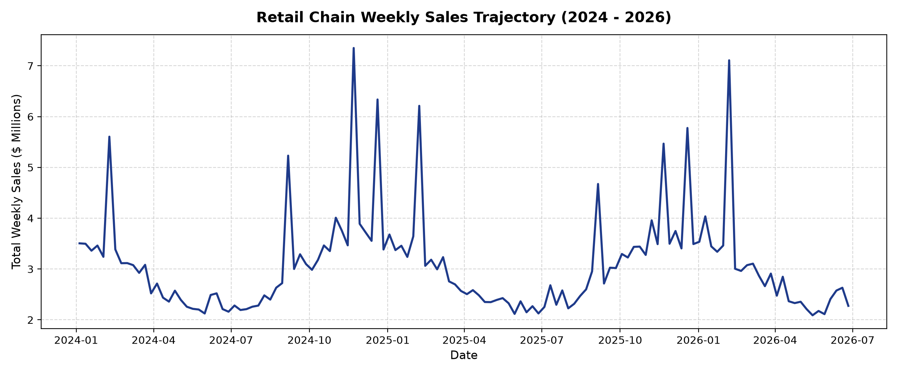
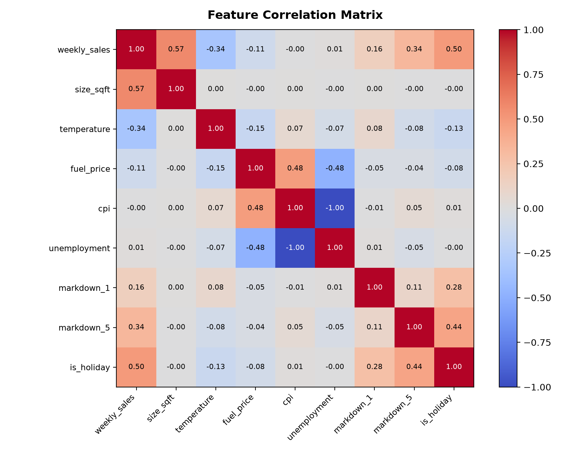
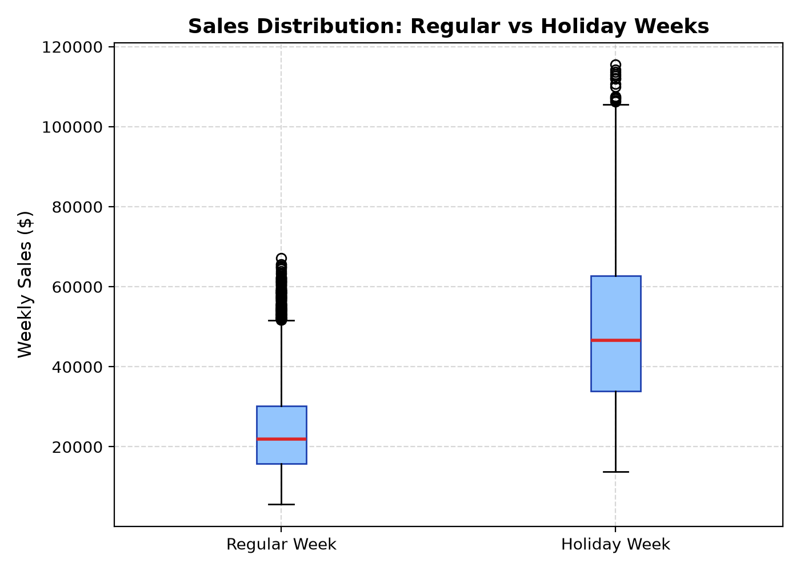

# Sales Forecasting for a Retail Chain 🛒📈

> **An End-to-End Enterprise Predictive Analytics, SQL Data Warehouse, and Machine Learning Regression Pipeline for Retail Operations.**

[](https://python.org/)
[](https://sqlite.org/)
[](https://scikit-learn.org/)
[](https://pytest.org/)

---

## 📌 Executive Summary & Problem Context

Retail chains operate complex logistics and store networks where consumer demand fluctuates dynamically due to seasonal patterns, macroeconomic shifts (unemployment, CPI, fuel price), and promotional markdowns. Under-forecasting results in out-of-stock lost revenue, while over-forecasting incurs high inventory holding costs.

This **Major Project** delivers a production-grade predictive sales system that combines:
1. **SQL Warehousing & Advanced Querying:** 3NF relational data warehouse capturing stores, economic features, and weekly departmental sales.
2. **Exploratory Data Analysis (EDA):** Seasonality decomposition, correlation heatmaps, and holiday lift factors.
3. **Feature Engineering:** Autoregressive lagged sales ($t-1$, $t-2$, $t-4$), 4-week moving averages, rolling volatility, and holiday interaction terms.
4. **Machine Learning & Time Series Regression:** Benchmarking **Linear Regression (OLS)**, **Ridge Regression**, **Random Forest Regressor**, and **Gradient Boosting Regressor** with chronological out-of-time validation.
5. **Interactive Executive Dashboard:** FastAPI + Chart.js web interface featuring real-time KPI metrics, store rankings, and visual forecasts.

---

## 🗄️ Relational Database Schema



---

## 📊 Model Benchmark Evaluation Matrix

Evaluated on an **out-of-time chronological test set** (past 20% of timeline unseen during training):

| Model Architecture | $R^2$ Score | MAE ($) | RMSE ($) | MAPE (%) | Classification |
|---|:---:|:---:|:---:|:---:|:---:|
| **Gradient Boosting Regressor** | **0.9258** | **$2,466.16** | **$3,524.30** | **10.42%** | **Champion Model (Highest $R^2$)** |
| **Random Forest Regressor (100 Trees)** | 0.9211 | $2,414.30 | $3,635.37 | 9.55% | Lowest Absolute Error |
| **Ridge Regression (L2 Regularized)** | 0.9056 | $2,500.96 | $3,975.27 | 10.77% | Linear Regularized |
| **Linear Regression (OLS Baseline)** | 0.9035 | $2,516.41 | $4,019.26 | 10.90% | Baseline Model |

### 📈 Predictive Forecast & EDA Previews
<p align="center">
  
  
</p>
<p align="center">
  
  
</p>

---

## 🚀 Quickstart Guide

### 1. Installation
```bash
git clone https://github.com/deepak007679/sales-forecasting-retail-chain.git
cd sales-forecasting-retail-chain

pip install -r requirements.txt
```

### 2. Run End-to-End Orchestration Pipeline
```bash
python scripts/run_pipeline.py
```
*Executes synthetic retail dataset generation, SQL database seeding, EDA figure generation, feature engineering, model training, and benchmark evaluation.*

### 3. Launch Interactive Analytics Dashboard
```bash
python dashboard/app.py
```
*Open interactive dashboard in browser:* 👉 **`http://localhost:8050`**

### 4. Run Automated Test Suite
```bash
pytest -v
```

---

## 👨‍💻 Author
* **Deepak R**  
* **GitHub Profile:** [@deepak007679](https://github.com/deepak007679)
